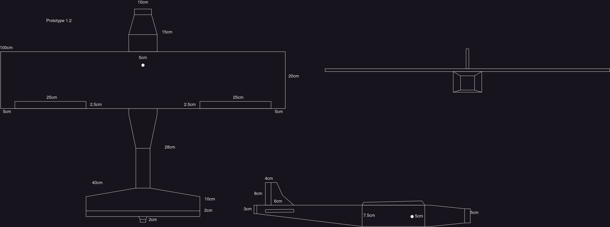

# RC Plane
DIY RC Plane built and designed from scratch.

[](https://github.com/dev-jtemel/rc_plane/actions/workflows/cmake.yml)
[](https://github.com/dev-jtemel/rc_plane/actions/workflows/codeql.yml)

- [Design](#design)
  - [Control Flow](#control-flow)
  - [Software](#software)
    - [SOM Architecture](#som-architecture)
    - [MCU Architecture](#mcu-architecture)
    - [Serial Communication](#serial-communication)
  - [Hardware](#hardware)
    - [Schematic](#schematic)
    - [RC Controller](#rc-controller)
  - [Plane Dimensions](#plane-dimensions)
- [Build](#build)
  - [Microcontroller](#microcontroller)
  - [SoM](#som)
  - [PC](#pc)
- [Requirements](#requirements)
  - [Physical](#physical)

## Design
This sections lays out the schematic of the hardware and the relation of the controls
of the flight controller to the plane.
### Control Flow


### Software
#### SOM Architecture


#### MCU Architecture


#### Serial Communication
Communication from the MCU to the SoM follows a 64-bit packet format defined as follows.


**Note**: Packets are always recevied in this order.

Timestamp buffer overflows at 16777215 milliseconds (16777.215 seconds; 279.62025 minutes; 4.66 hours), well exceeding any possible flight times. Note that the timestamp resets upon an initial read of the serial port from the MCU since the microcontroller resets on an initial read.

Packets are written to the serial port in HEX, with each line containing exactly 8 bytes of data. 

When the serial connection is opened on the SOM, there is a chance of buffered data to be read before the microcontroller resets. To ensure the serial reader gets the packets in the order expected, all packets are discarded on the SOM until four "start" packets are read consecutively. A start packet is defined as: `0xFFFFFFFFFFFFFFFF`.

### Hardware

#### Schematic
The following schematic lays out the hardware design of the plane.


For direct access to pin mapping, see the `pins.hpp` file in the `mcu` library.

#### RC Controller
The following schematic lays out the control mapping of transmitter.


| **Channel** | **Functionality**  |
|---------------|------------------|
| CH1 | Roll |
| CH2 | Pitch |
| CH3 | Motor Speed |
| CH4 | Yaw |
| CH5 | Unassigned |
| CH6 | Unassigned |


### Plane Dimensions
The dimensions of the plane are laid out in the following sketch.



The Dimensions were calculated as follows:
| **Identifier** | **Relation**  | **Result** |
|----------|-----------|----------------------|
| Chord \(C\) | N/A | 20cm |
| Wingspan (WS) | 5 x C | 100cm |
| WingArea (WA) | C x WS | 2000cm^2 |
| Fuselage Length (FL) | 75% of WS | 75cm |
| Nose Length (NL) | 20% of FL | 15cm |
| Mid Length (ML) | ~37% of FL | 28cm |
| Tail Length (TL) | ~2.5% of FL | 2cm |
| Fuselage Height (FH) | 10% of FL | 7.5cm |
| Horz. Stabilizer Width (HSW) | FL - NL - ML - TL | 10cm |
| Horz. Stabilizer Area (HSA) | 20% of WA | 400cm^2 |
| Horz. Stabilizer Length (HSL) | HSA / HSW | 40cm |
| Aileron Width (AW) | 12.5% of C | 2.5cm |
| Aileron Length (AL) | 10 x AW | 25cm |
| Elevator Width (EW) | (20% of HSA) / HSL | 2cm |
| Elevator Length (EL) | HSL | 40cm |
| Vert. Stabilizer Area (VSA) | 33% of HSA | 132 cm^2 |
| Vert. Stabilizer Width (VSW) | HSW - EW | 8cm |
| Vert. Stabilizer Height (VSH) | VSW | 8cm |
| Rudder Area (RA) | 50% of VSA | 66cm |
| Rudder Height (RH) | VSH | 8cm |
| Rudder Width (RW) | 50% VSW | 4cm |
| Angle of Attack (AoA) | | 3deg |
| Dihedral (D) | | 2deg |
| Center of Gravity (CoG) | 25% of C | 5cm |

## Build
To compile the entire project, use the `full_build.sh` script. The following sections layout how to
compile and flash each section of software.

### Microcontroller
Using the `builder.sh` script, deploy the following commands *after* the microcontroller's USB port is connected to your computer **and** the 9V power supply is turned on:

```shell
./builder.sh
8 # Install dependencies (only needed on first clone)
1 # Cycle to MCU
2 # Compile the MCU library
3 # Flash the microcontroller
7 # Optional to view serial data output (CTRL+A CTRL+X to exit).
```

### SoM
Provide the IP of the SOM to the builder and execute the following commands:

```shell
./builder.sh -i <IP>
8 # Install dependencies
1 # Cycle to SOM
2 # Compile the SOM library
3 # Flash SOM
4 # Run SOM
```

### PC
Using the `builder.sh` script, deploy the following commands:

```shell
./builder.sh
1 # Cycle to PC
2 # Compile the PC library
3 # Flash PC
4 # Run PC
```

### Running
Turn on all power supplies and connect the MCU to the SoM via a serial connection. Then start the SoM controller followed by the PC controller:
```
./builder.sh
1 # Cycle to SOM
4 # Run the SOM controller
```

If the GNSS recevier is **not** connected to the SOM, simulate GNSS flow with GPSFake. Failure to parse GPS data will abort the SOM controller.
```
./builder.sh
1 # Cycle to SOM
6 # Run GPSFake
```
## Requirements
This section lays out the requirements, both virtual and physical, needed for the rc plane.

### Physical
The following components are used in the build:
- (1x) Raspberry PI 4B+ (or similar)
- (1x) Arduino Mega 2560 Rev3 (or similar)
- (1x) FS-IA10B 2.4GHz 10 Channel DC Receiver
- (1x) Skynet FS 2.4GHz Transmitter
- (5x) Tower Pro 9G micro servos
- (1x) 40A ESC
- (1x) 3S 6000mAh LiPo (or similar)
- (1x) Brushless DC Motor
- (1x) USB-A GNSS Receiver
- (3x) 220 Ohm resistors
- (1) Green LED
- (1) Red LED
- (1) Blue LED
