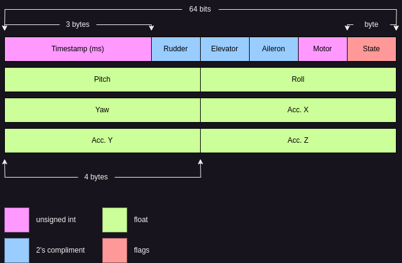

# RC Plane
DIY RC Plane built and designed from scratch.

- [Design](#design)
 - [Hardware](#hardware)
   - [RC Controller](#rc-controller)
   - [Schematic](#schematic)
  - [Software](#software)
    - [Serial Communication](#serial-communication)
  - [Plane Dimensions](#plane-dimensions)
- [Build](#build)
 - [Microcontroller](#microcontroller)
 - [SoM](#som)
 - [PC](#pc)
- [Requirements](#requirements)
  - [Physical](#physical)

## Design
This sections lays out the schematic of the hardware and the relation of the controls
of the flight controller to the plane.

### Hardware

#### RC Controller
The following schematic lays out the control mapping of transmitter.


#### Schematic
The following schematic lays out the hardware design of the plane.


For direct access to pin mapping, see the `pins.hpp` file in the `mcu` library.

### Software
#### Serial Communication
Communication from the MCU to the SoM follows a 64-bit packet format defined as follows.



where:
| **Bits** | **Type**  | **Two's Compliment** |
|----------|-----------|----------------------|
| 0-7      | State     | False                |
| 8-15     | Motor     | False                |
| 16-23    | Aileron   | True                 |
| 24-31    | Elevator  | True                 |
| 32-39    | Rudder    | True                 |
| 40-63    | Timestamp | False                |

Timestamp buffer overflows at 16777215 milliseconds (16777.215 seconds; 279.62025 minutes; 4.66 hours), well exceeding any possible flight times. Note that the timestamp resets upon an initial read of the serial port from the MCU since the microcontroller resets on an initial read.

### Plane Dimensions
The dimensions of the plane are laid out in the following sketch.


## Build
To compile the entire project, use the `full_build.sh` script. The following sections layout how to
compile and flash each section of software.

### Microcontroller
Using the `builder.sh` script, deploy the following commands *after* the microcontroller's USB port is connected to your computer **and** the 9V power supply is turned on:

```shell
./builder.sh
6 # Install dependencies
1 # Compile the MCU library
4 # Flash the microcontroller
8 # Optional to view serial data output (CTRL+A CTRL+X to exit).
```

### SoM
SSH into the SoM, and clone/pull the latest changes of the repo. Using the `builder.sh` script, deploy the following commands:

```shell
./builder.sh
6 # Install dependencies
2 # Compile the SoM library
```

### PC
Using the `builder.sh` script, deploy the following commands:

```shell
./builder.sh
6 # Install dependencies
3 # Compile the PC library
```

### Running
Turn on all power supplies and connect the MCU to the SoM via a serial connection. Then start the SoM controller followed by the PC controller:
```
# On the SoM
./builder.sh
6 # Run the SoM controller
```
```
# On the PC
./builder.sh
7 # Run the PC controller
```
## Requirements
This section lays out the requirements, both virtual and physical, needed for the rc plane.

### Physical
The following components are used in the build:
- (1x) Arduino Mega 2560 Rev3
- (1x) 9V DC breadboard power supply (+9V battery)
- (1x) FS-IA10B 2.4GHz 10 Channel DC receiver
- (5x) Tower Pro 9G micro servos
- (1x) L293D motor controller
- (2x) Brushed DC motor
- (3x) 220 Ohm resistors
- (1) Green LED
- (1) Red LED
- (1) Blue LED
