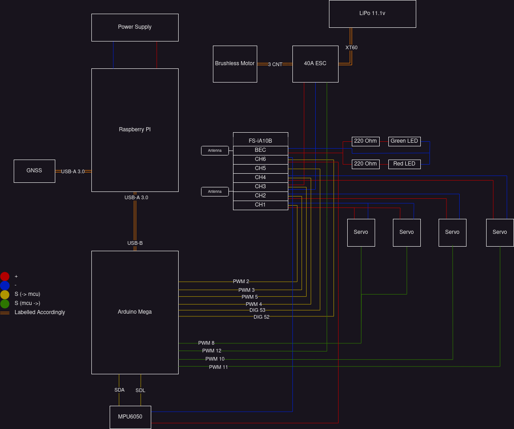

# RC Plane
DIY RC Plane built and designed from scratch.

 - [Design](#design)
   - [Hardware](#hardware)
     - [RC Controller](#rc-controller)
     - [Schematic](#schematic)
    - [Software](#software)
 - [Build](#build)
   - [Microcontroller](#microcontroller)
 - [Requirements](#requirements)
    - [Physical](#physical)

## Design
This sections lays out the schematic of the hardware and the relation of the controls
of the flight controller to the plane.

### Hardware

#### RC Controller
The following schematic lays out the control mapping of transmitter.


#### Schematic
The following schematic lays out the hardware design of the plane.



For direct access to pin mapping, see the `pins.hpp` file in the `mcu` library.

### Software

## Build
To compile the entire project, use the `full_build.sh` script. The following sections layout how to
compile and flash each section of software.

### Microcontroller
Using the `builder.sh` script, deploy the following commands *after* the microcontroller's USB port is connected to your computer **and** the 9V power supply is turned on.

```shell
./builder.sh
6 # Install dependencies
1 # Compile the MCU library
2 # Flash the microcontroller
3 # Optional to view serial data output (CTRL+A CTRL+X to exit).
```

## Requirements
This section lays out the requirements, both virtual and physical, needed for the rc plane.

### Physical
The following components are used in the build:
- (1x) Arduino Mega 2560 Rev3
- (1x) 9V DC breadboard power supply (+9V battery)
- (1x) FS-IA10B 2.4GHz 10 Channel DC receiver
- (5x) Tower Pro 9G micro servos
- (1x) L293D motor controller
- (2x) Brushed DC motor
- (3x) 220 Ohm resistors
- (1) Green LED
- (1) Red LED
- (1) Blue LED
